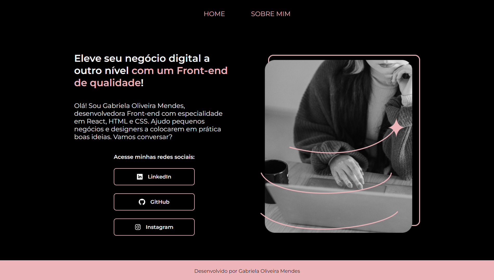

<h1>Portifólio</h1>

Portifólio realizado no curso de HTML e CSS da plataforma Alura.

<h2>Contato</h2>
<a href="mailto:gabimendes7@gmail.com" target=_blank>E-mail</a>

<a href="https://portifolio-seven-bay.vercel.app/" target=_blank>Link do projeto</a>

  
English README

  <h1>Portfolio</h1>
  
  
Portfolio made during the HTML and CSS course on Alura platform.

  
  
  

  
  

  <h2>Contact</h2>
  <a href="mailto:gabimendes7@gmail.com" target=_blank>E-mail</a>

  <a href="https://portifolio-seven-bay.vercel.app/" target=_blank>Project link</a>
  

